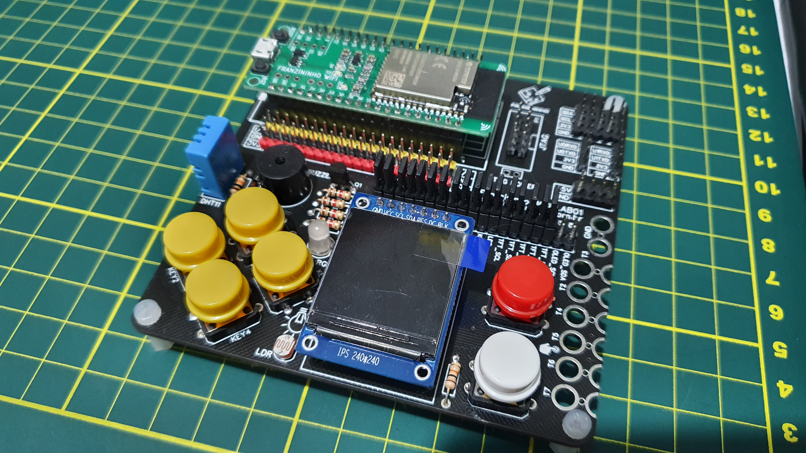

# Franzininho-WiFi-LAB01

Franzininho WiFI LAB01 is an expansion board for the [Franzinho WiFi board](https://github.com/Franzininho/Franzininho-WiFi).
 

## Features

- 6 keys
- Display IPS 240x240 St7789 OR OLED 0.96 SSD1306
- DHT11
- LDR
- RGB LED
- BUZZER
- ALIGATOR CLIPS FOR TOUCH or DiGital Inputs
- JTAG
- I2C HEADERS
- UART HEADERS 
